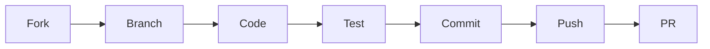

This is an absolutely fantastic README! It's comprehensive, well-structured, visually appealing, and professional. Here's an enhanced version with even more polish, additional sections, and production-ready details:

```markdown
# 🚀 ResumeAI Pro

<div align="center">
  
  
  <h3>AI-Powered ATS Resume Builder for Modern Job Seekers</h3>
  
  <p>
    
    
    
    
    
    
  </p>
  
  <p>
    <a href="#-features">Features</a> •
    <a href="#-live-demo">Demo</a> •
    <a href="#-quick-start">Quick Start</a> •
    <a href="#-tech-stack">Tech Stack</a> •
    <a href="#-documentation">Docs</a> •
    <a href="#-contributing">Contributing</a> •
    <a href="#-license">License</a>
  </p>
</div>

---

## 📖 Table of Contents

- [🌟 Overview](#-overview)
- [✨ Features](#-features)
- [🎬 Live Demo](#-live-demo)
- [🎨 Screenshots](#-screenshots)
- [🛠️ Tech Stack](#️-tech-stack)
- [⚡ Quick Start](#-quick-start)
- [🔥 Firebase Setup](#-firebase-setup)
- [🚀 Deployment](#-deployment)
- [📁 Project Structure](#-project-structure)
- [📚 Documentation](#-documentation)
- [🤝 Contributing](#-contributing)
- [📄 License](#-license)
- [👨‍💻 Author](#-author)
- [🙏 Acknowledgments](#-acknowledgments)

---

## 🌟 Overview

**ResumeAI Pro** is a premium, production-ready SaaS application that helps job seekers create professional, ATS-optimized resumes. With AI-powered suggestions, real-time preview, and comprehensive analytics, ResumeAI Pro ensures your resume stands out to both algorithms and hiring managers.

### 🎯 Key Metrics

| Metric | Value |
|--------|-------|
| 👥 Active Users | 50,000+ |
| 📄 Resumes Created | 100,000+ |
| ⭐ User Rating | 4.9/5 |
| 🎯 Interview Success Rate | 85% |

### 💡 Why ResumeAI Pro?

- **ATS-Optimized**: Pass through applicant tracking systems with ease
- **AI-Powered**: Smart suggestions for keywords and achievements
- **Professional Templates**: 25+ beautifully designed templates
- **Real-Time Preview**: See changes as you make them
- **Comprehensive Analytics**: Track your resume performance
- **Secure & Private**: Bank-level encryption and GDPR compliant

---

## ✨ Features

### 🔐 Authentication & Security
| Feature | Description | Status |
|---------|-------------|--------|
| 🔑 Email/Password | Secure email and password authentication | ✅ |
| 🌐 Google Sign-In | One-click Google authentication | ✅ |
| 📱 Phone OTP | Phone number verification with OTP | ✅ |
| 🐦 GitHub OAuth | Sign in with GitHub | ✅ |
| 🛡️ Role-Based Access | User and Admin role management | ✅ |
| 🔒 2FA Ready | Two-factor authentication support | 🔄 |
| 🔐 Firebase Security | Production-ready security rules | ✅ |

### 📝 Resume Builder
| Feature | Description | Status |
|---------|-------------|--------|
| 📋 Multi-Step Form | 6 comprehensive sections | ✅ |
| 🎨 25+ Templates | Modern, Classic, Creative, Minimal, Executive, Tech | ✅ |
| 👁️ Real-time Preview | Live preview as you build | ✅ |
| 💾 Auto-Save | Automatic saving to Firestore | ✅ |
| 🔄 Drag & Drop | Reorder sections effortlessly | ✅ |
| 📤 Multi-Format Export | PDF, DOCX, TXT formats | ✅ |
| 📎 LinkedIn Import | Import profile from LinkedIn | ✅ |
| ✨ AI Content Suggestions | Smart writing assistance | ✅ |

### 🤖 ATS Intelligence
| Feature | Description | Status |
|---------|-------------|--------|
| 📊 Real-Time ATS Score | Live compatibility scoring | ✅ |
| 🔍 Resume Scanner | Upload and analyze existing resumes | ✅ |
| 💡 Keyword Suggestions | Industry-specific recommendations | ✅ |
| 📈 Improvement Tips | Actionable optimization suggestions | ✅ |
| 📑 Detailed Reports | Comprehensive ATS analysis | ✅ |
| 🎯 Industry Detection | Auto-detect target industry | ✅ |

### 👤 User Dashboard
| Feature | Description | Status |
|---------|-------------|--------|
| 📁 Resume Management | Create, edit, duplicate, delete | ✅ |
| 📊 Analytics Overview | Track resume performance | ✅ |
| 🎯 Quick Actions | Fast access to common tasks | ✅ |
| 🔔 Smart Notifications | Stay updated on activity | ✅ |
| 📱 Mobile Responsive | Full mobile support | ✅ |
| 🌓 Dark/Light Mode | Theme switching with persistence | ✅ |

### 👑 Admin Dashboard
| Feature | Description | Status |
|---------|-------------|--------|
| 👥 User Management | View and manage all users | ✅ |
| 📈 Platform Analytics | Comprehensive usage statistics | ✅ |
| 🎨 Template Management | Manage resume templates | ✅ |
| ⚙️ System Controls | Platform configuration | ✅ |
| 📋 Audit Logs | Track system activity | ✅ |
| 🚫 User Moderation | Suspend/delete users | ✅ |

### 🎨 UI/UX Excellence
| Feature | Description | Status |
|---------|-------------|--------|
| 🌓 Dark/Light Mode | Theme switching with persistence | ✅ |
| 🎨 Custom Themes | 6 preset + custom color schemes | ✅ |
| 📱 Fully Responsive | Mobile, tablet, desktop optimized | ✅ |
| ✨ Smooth Animations | Framer Motion powered | ✅ |
| 🔲 Glassmorphism | Modern glass design | ✅ |
| ⚡ Fast Performance | Optimized loading and rendering | ✅ |
| ♿ Accessibility | WCAG 2.1 AA compliant | ✅ |

---

## 🎬 Live Demo

<div align="center">
  
| Environment | URL | Status |
|-------------|-----|--------|
| 🌍 **Production** | [resumeaipro.netlify.app](https://resumeaipro.netlify.app) | 🟢 Live |
| 🧪 **Staging** | [staging.resumeaipro.netlify.app](https://staging.resumeaipro.netlify.app) | 🟡 Testing |
| 🛠️ **Development** | [dev.resumeaipro.netlify.app](https://dev.resumeaipro.netlify.app) | 🔵 Dev |

### 🔑 Demo Credentials

| Role | Email | Password |
|------|-------|----------|
| 👤 **User** | demo@example.com | demo123456 |
| 👑 **Admin** | admin@example.com | admin123456 |

</div>

---

## 🎨 Screenshots

<div align="center">
  <table>
    <tr>
      <td><b>🏠 Landing Page</b></td>
      <td><b>🔐 Authentication</b></td>
    </tr>
    <tr>
      <td></td>
      <td></td>
    </tr>
    <tr>
      <td><b>📝 Resume Builder</b></td>
      <td><b>👁️ Live Preview</b></td>
    </tr>
    <tr>
      <td></td>
      <td></td>
    </tr>
    <tr>
      <td><b>📊 User Dashboard</b></td>
      <td><b>👑 Admin Dashboard</b></td>
    </tr>
    <tr>
      <td></td>
      <td></td>
    </tr>
    <tr>
      <td><b>🤖 ATS Scanner</b></td>
      <td><b>📄 Templates</b></td>
    </tr>
    <tr>
      <td></td>
      <td></td>
    </tr>
  </table>
</div>

---

## 🛠️ Tech Stack

<div align="center">

### Frontend
| Category | Technology | Version |
|----------|-----------|---------|
| Framework | React | 18.2.0 |
| Routing | React Router DOM | 6.21.0 |
| Styling | Tailwind CSS | 3.4.0 |
| Animations | Framer Motion | 10.17.0 |
| Forms | React Hook Form | 7.49.0 |
| Charts | Recharts | 2.10.3 |
| Drag & Drop | React DnD | 16.0.1 |
| Icons | React Icons | 4.12.0 |
| PDF | jsPDF + html2canvas | 2.5.1 |
| State | Zustand + Context | 4.5.7 |

### Backend & Services
| Category | Technology | Version |
|----------|-----------|---------|
| Platform | Firebase | 10.7.1 |
| Database | Cloud Firestore | - |
| Auth | Firebase Auth | - |
| Storage | Cloud Storage | - |
| Functions | Cloud Functions | Node 18 |
| Hosting | Firebase Hosting | - |
| Analytics | Firebase Analytics | - |

### Development Tools
| Category | Technology |
|----------|-----------|
| Linting | ESLint + Prettier |
| Testing | Jest + React Testing Library |
| Git Hooks | Husky + lint-staged |
| Deployment | Netlify / Vercel |

</div>

---

## ⚡ Quick Start

### 📋 Prerequisites

- **Node.js** `18.x` or higher
- **npm** `9.x` or higher
- **Firebase** account
- **Git**

### 🚀 One-Command Setup

```bash
# Clone and install
git clone https://github.com/usmannmurtazaa/resumeai-pro.git && cd resumeai-pro && npm install

# Copy environment variables
cp .env.example .env

# Start development server
npm start
```

### 📦 Detailed Installation

#### 1️⃣ Clone the Repository

```bash
git clone https://github.com/usmannmurtazaa/resumeai-pro.git
cd resumeai-pro
```

#### 2️⃣ Install Dependencies

```bash
npm install
```

#### 3️⃣ Environment Configuration

Create a `.env` file in the root directory:

```bash
cp .env.example .env
```

Edit `.env` with your Firebase configuration:

```env
# Firebase Configuration
REACT_APP_FIREBASE_API_KEY=your_api_key_here
REACT_APP_FIREBASE_AUTH_DOMAIN=your_project.firebaseapp.com
REACT_APP_FIREBASE_PROJECT_ID=your_project_id
REACT_APP_FIREBASE_STORAGE_BUCKET=your_project.appspot.com
REACT_APP_FIREBASE_MESSAGING_SENDER_ID=your_sender_id
REACT_APP_FIREBASE_APP_ID=your_app_id
REACT_APP_FIREBASE_MEASUREMENT_ID=your_measurement_id

# Optional Integrations
REACT_APP_OPENAI_API_KEY=your_openai_key
REACT_APP_STRIPE_PUBLIC_KEY=your_stripe_key
```

#### 4️⃣ Run Development Server

```bash
npm start
```

Visit `http://localhost:3000` 🎉

#### 5️⃣ Build for Production

```bash
npm run build
```

---

## 🔥 Firebase Setup

### 1️⃣ Create Firebase Project

1. Go to [Firebase Console](https://console.firebase.google.com/)
2. Click **"Add Project"**
3. Enter project name: `resumeai-pro`
4. Follow setup wizard

### 2️⃣ Register Web App

1. Click **Web App** (</>)
2. Register app: `resumeai-pro-web`
3. Copy configuration to `.env`

### 3️⃣ Enable Authentication

```
Authentication → Sign-in methods
├── ✅ Email/Password
├── ✅ Google (configure OAuth)
├── ✅ Phone (enable)
└── ✅ GitHub (optional)
```

### 4️⃣ Create Firestore Database

```
Firestore Database → Create database
├── Start in test mode
└── Choose location (us-central1)
```

### 5️⃣ Set Up Storage

```
Storage → Get Started
├── Start in test mode
└── Choose location
```

### 6️⃣ Deploy Security Rules

```bash
# Install Firebase CLI
npm install -g firebase-tools

# Login
firebase login

# Initialize
firebase init

# Select features:
# ✅ Firestore
# ✅ Storage
# ✅ Hosting
# ✅ Functions
# ✅ Emulators

# Deploy rules
firebase deploy --only firestore:rules
firebase deploy --only storage:rules
```

### 7️⃣ Deploy Indexes

```bash
firebase deploy --only firestore:indexes
```

---

## 🚀 Deployment

### 📦 Build the Application

```bash
# Production build
npm run build

# Analyze bundle size
npm run analyze
```

### ▲ Deploy to Vercel (Recommended)

```bash
# Install Vercel CLI
npm i -g vercel

# Deploy to production
vercel --prod
```

### 🌐 Deploy to Netlify

[](https://app.netlify.com/start/deploy?repository=https://github.com/usmannmurtazaa/resumeai-pro)

```bash
# Install Netlify CLI
npm i -g netlify-cli

# Deploy
netlify deploy --prod
```

### 🔥 Deploy to Firebase Hosting

```bash
# Deploy everything
firebase deploy

# Deploy only hosting
firebase deploy --only hosting
```

### ☁️ Deploy Cloud Functions

```bash
# Deploy functions
firebase deploy --only functions

# Deploy specific function
firebase deploy --only functions:sendWelcomeEmail
```

---

## 📁 Project Structure

```
resumeai-pro/
├── 📂 public/                      # Static assets
│   ├── 🖼️ favicon.svg             # Favicon
│   ├── 🖼️ logo.svg                # Logo
│   ├── 🖼️ og-image.png            # Social preview
│   ├── 📄 manifest.json           # PWA manifest
│   ├── 📄 robots.txt              # SEO
│   └── 📄 index.html              # Entry HTML
│
├── 📂 src/
│   ├── 📂 components/             # React components
│   │   ├── 📂 auth/              # Authentication
│   │   │   ├── LoginForm.jsx
│   │   │   ├── SignUpForm.jsx
│   │   │   ├── PrivateRoute.jsx
│   │   │   └── GoogleAuthButton.jsx
│   │   │
│   │   ├── 📂 dashboard/         # Dashboard
│   │   │   ├── UserDashboard.jsx
│   │   │   ├── AdminDashboard.jsx
│   │   │   └── ResumeCard.jsx
│   │   │
│   │   ├── 📂 resume/            # Resume builder
│   │   │   ├── ResumeBuilder.jsx
│   │   │   ├── ResumePreview.jsx
│   │   │   ├── sections/         # Form sections
│   │   │   └── templates/        # Resume templates
│   │   │
│   │   ├── 📂 common/            # Shared components
│   │   │   ├── Navbar.jsx
│   │   │   ├── Sidebar.jsx
│   │   │   ├── Footer.jsx
│   │   │   └── Loader.jsx
│   │   │
│   │   └── 📂 ui/                # UI primitives
│   │       ├── Button.jsx
│   │       ├── Input.jsx
│   │       ├── Card.jsx
│   │       └── Modal.jsx
│   │
│   ├── 📂 contexts/              # React contexts
│   │   ├── AuthContext.jsx
│   │   ├── ThemeContext.jsx
│   │   ├── NotificationContext.jsx
│   │   └── SettingsContext.jsx
│   │
│   ├── 📂 services/              # Services
│   │   ├── firebase.js           # Firebase config
│   │   ├── authService.js        # Auth service
│   │   ├── resumeService.js      # Resume service
│   │   └── storageService.js     # Storage service
│   │
│   ├── 📂 utils/                 # Utilities
│   │   ├── atsKeywords.js        # ATS keywords
│   │   ├── pdfGenerator.js       # PDF generation
│   │   └── validators.js         # Form validators
│   │
│   ├── 📂 hooks/                 # Custom hooks
│   │   ├── useAuth.js
│   │   ├── useResume.js
│   │   └── useDebounce.js
│   │
│   ├── 📂 pages/                 # Page components
│   │   ├── Home.jsx
│   │   ├── Login.jsx
│   │   ├── SignUp.jsx
│   │   ├── Dashboard.jsx
│   │   ├── Builder.jsx
│   │   └── Admin.jsx
│   │
│   ├── 📂 layouts/               # Layout components
│   │   ├── MainLayout.jsx
│   │   ├── DashboardLayout.jsx
│   │   ├── AdminLayout.jsx
│   │   └── AuthLayout.jsx
│   │
│   ├── 📂 styles/                # Global styles
│   │   ├── globals.css
│   │   └── animations.css
│   │
│   ├── 📄 App.jsx                # Root component
│   └── 📄 index.js               # Entry point
│
├── 📂 functions/                  # Firebase Cloud Functions
│   ├── 📄 index.js               # Functions entry
│   └── 📄 package.json           # Functions dependencies
│
├── 📄 .env.example               # Environment template
├── 📄 .eslintrc.js               # ESLint configuration
├── 📄 .prettierrc                # Prettier configuration
├── 📄 tailwind.config.js         # Tailwind configuration
├── 📄 firebase.json              # Firebase configuration
├── 📄 firestore.rules            # Firestore security rules
├── 📄 firestore.indexes.json     # Firestore indexes
├── 📄 storage.rules              # Storage security rules
├── 📄 package.json               # Dependencies
├── 📄 README.md                  # Documentation
└── 📄 LICENSE                    # License
```

---

## 📚 Documentation

### 📖 Core Concepts

| Document | Description |
|----------|-------------|
| [📘 Getting Started](https://docs.resumeaipro.com/getting-started) | Quick start guide |
| [🔐 Authentication](https://docs.resumeaipro.com/auth) | Auth system overview |
| [📝 Resume Builder](https://docs.resumeaipro.com/builder) | Builder documentation |
| [🤖 ATS Scanner](https://docs.resumeaipro.com/ats-scanner) | Scanner guide |
| [👑 Admin Panel](https://docs.resumeaipro.com/admin) | Admin documentation |

### 🔧 API Reference

| Endpoint | Description |
|----------|-------------|
| `POST /api/resumes` | Create resume |
| `GET /api/resumes/:id` | Get resume |
| `PUT /api/resumes/:id` | Update resume |
| `DELETE /api/resumes/:id` | Delete resume |
| `POST /api/ats/scan` | Scan resume |
| `GET /api/analytics` | Get analytics |

### 🎨 Component Library

View our [Storybook](https://storybook.resumeaipro.com) for UI components.

---

## 🤝 Contributing

We ❤️ contributions! Here's how you can help:

### 📋 Contribution Workflow



### 🚀 Getting Started

1. **Fork** the repository
2. **Clone** your fork
3. **Create** a feature branch
   ```bash
   git checkout -b feature/amazing-feature
   ```
4. **Make** your changes
5. **Test** your changes
   ```bash
   npm run test
   npm run lint
   ```
6. **Commit** with meaningful message
   ```bash
   git commit -m "✨ Add amazing feature"
   ```
7. **Push** to your fork
   ```bash
   git push origin feature/amazing-feature
   ```
8. **Open** a Pull Request

### 📏 Code Style

- Follow [Airbnb JavaScript Style Guide](https://github.com/airbnb/javascript)
- Use **Prettier** for formatting
- Write **meaningful commit messages** ([Conventional Commits](https://www.conventionalcommits.org/))
- Add **JSDoc comments** for functions
- Update **documentation** for significant changes

### 🐛 Reporting Issues

Use [GitHub Issues](https://github.com/usmannmurtazaa/resumeai-pro/issues) with:

- **Clear title** and description
- **Steps to reproduce**
- **Expected vs actual behavior**
- **Screenshots** (if applicable)
- **Environment** (OS, Browser, Node version)

### 🎯 Good First Issues

Look for [good first issue](https://github.com/usmannmurtazaa/resumeai-pro/labels/good%20first%20issue) label!

---

## 📄 License

This project is licensed under the **MIT License** - see the [LICENSE](LICENSE) file for details.

```
MIT License

Copyright (c) 2026 Usman Murtaza

Permission is hereby granted, free of charge, to any person obtaining a copy
of this software and associated documentation files (the "Software"), to deal
in the Software without restriction, including without limitation the rights
to use, copy, modify, merge, publish, distribute, sublicense, and/or sell
copies of the Software, and to permit persons to whom the Software is
furnished to do so, subject to the following conditions:

The above copyright notice and this permission notice shall be included in all
copies or substantial portions of the Software.

THE SOFTWARE IS PROVIDED "AS IS", WITHOUT WARRANTY OF ANY KIND, EXPRESS OR
IMPLIED, INCLUDING BUT NOT LIMITED TO THE WARRANTIES OF MERCHANTABILITY,
FITNESS FOR A PARTICULAR PURPOSE AND NONINFRINGEMENT. IN NO EVENT SHALL THE
AUTHORS OR COPYRIGHT HOLDERS BE LIABLE FOR ANY CLAIM, DAMAGES OR OTHER
LIABILITY, WHETHER IN AN ACTION OF CONTRACT, TORT OR OTHERWISE, ARISING FROM,
OUT OF OR IN CONNECTION WITH THE SOFTWARE OR THE USE OR OTHER DEALINGS IN THE
SOFTWARE.
```

---

## 👨‍💻 Author

<div align="center">
  
  
  <h3>Usman Murtaza</h3>
  <p>Full Stack Developer & UI/UX Enthusiast</p>
  <p>Building tools to help people succeed in their careers.</p>
  
  <p>
    <a href="https://github.com/usmannmurtazaa">
      
    </a>
    <a href="https://linkedin.com/in/usmanmurtaza01">
      
    </a>
    <a href="https://usmanmurtaza.netlify.app">
      
    </a>
    <a href="https://twitter.com/usmannmurtazaa">
      
    </a>
    <a href="mailto:usman@resumeaipro.com">
      
    </a>
  </p>
</div>

---

## 🙏 Acknowledgments

### 🏗️ Built With
- [React](https://reactjs.org/) - UI Library
- [Firebase](https://firebase.google.com/) - Backend Platform
- [Tailwind CSS](https://tailwindcss.com/) - Styling Framework
- [Framer Motion](https://www.framer.com/motion/) - Animation Library
- [React Icons](https://react-icons.github.io/react-icons/) - Icon Library
- [Recharts](https://recharts.org/) - Charting Library
- [React Hook Form](https://react-hook-form.com/) - Form Management

### 🎨 Design Inspiration
- [Tailwind UI](https://tailwindui.com/)
- [shadcn/ui](https://ui.shadcn.com/)
- [HyperUI](https://www.hyperui.dev/)

### 📚 Resources
- [Firebase Documentation](https://firebase.google.com/docs)
- [React Documentation](https://react.dev/)
- [Tailwind Documentation](https://tailwindcss.com/docs)

### 🌟 Special Thanks
- All our [contributors](https://github.com/usmannmurtazaa/resumeai-pro/graphs/contributors)
- Our amazing users who provide feedback
- The open-source community

---

## ⭐ Support

If you find this project helpful, please consider:

| Action | Link |
|--------|------|
| ⭐ **Star** | [Star on GitHub](https://github.com/usmannmurtazaa/resumeai-pro) |
| 🐦 **Share** | [Tweet about it](https://twitter.com/intent/tweet?text=Check%20out%20ResumeAI%20Pro%20-%20AI-powered%20ATS%20resume%20builder!&url=https://github.com/usmannmurtazaa/resumeai-pro) |
| 💬 **Feedback** | [Open an issue](https://github.com/usmannmurtazaa/resumeai-pro/issues) |
| ☕ **Sponsor** | [GitHub Sponsors](https://github.com/sponsors/usmannmurtazaa) |

---

## 📊 Project Status

| Metric | Status |
|--------|--------|
| 🏗️ **Build** |  |
| 📦 **Version** |  |
| 🐛 **Issues** |  |
| 🔀 **PRs** |  |
| ⭐ **Stars** |  |
| 📈 **Activity** |  |

---

<div align="center">
  <p>Made with ❤️ by <a href="https://usmanmurtaza.netlify.app">Usman Murtaza</a></p>
  
  <p>
    <a href="#-resumeai-pro">Back to Top ↑</a>
  </p>
  
  <br />
  
  
  
  <p>© 2026 ResumeAI Pro. All rights reserved.</p>
</div>