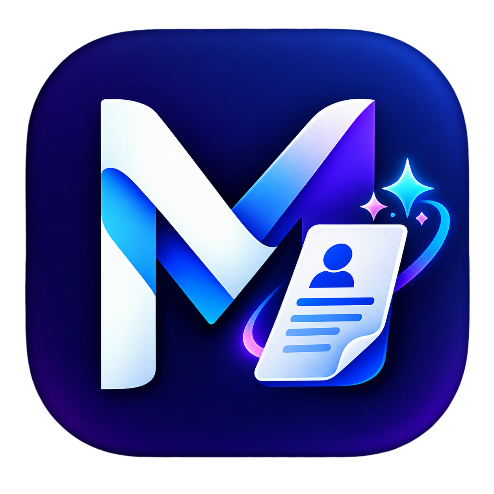

# 🚀 ResumeAI Pro

<div align="center">
  

> An AI-powered resume builder that generates ATS-optimised resumes with customisable templates, AI-driven content suggestions, and one-click export.

**Built by [Usman Murtaza](https://usmanmurtaza.netlify.app)** - Full Stack Developer

[](https://resumeaixpro.netlify.app)
[](https://usmanmurtaza.netlify.app)

<p>
  
  
  
  
  
  
</p>

</div>

---

## 📖 Overview

**ResumeAI Pro** is a full-stack SaaS application that helps job seekers build professional, ATS-friendly resumes with AI assistance. It combines a multi-step resume editor, AI-driven content suggestions, and a clean preview experience so users can move from a blank page to a ready-to-send resume quickly.

The project was designed and built end-to-end by **[Usman Murtaza](https://usmanmurtaza.netlify.app)** as part of the broader portfolio of products he develops.

---

## ✨ Features

### Resume Builder
- Multi-step editor covering personal details, experience, education, skills, projects, and certifications
- Live preview that updates as you type
- Auto-save to Firestore
- Multiple resume templates with distinct visual styles
- Export to PDF

### AI Assistance
- AI-driven content suggestions for summaries, bullet points, and skill descriptions
- Suggestions powered by the OpenAI API
- ATS-focused phrasing prompts

### Authentication & Data
- Email/password authentication via Firebase
- Google sign-in
- Per-user resume storage in Cloud Firestore
- User dashboard for managing multiple resumes

### UI/UX
- Responsive layout across mobile, tablet, and desktop
- Dark theme with glassmorphism styling
- Smooth transitions and micro-interactions
- Accessible markup and keyboard navigation

---

## 🎬 Live Demo

**[resumeaixpro.netlify.app](https://resumeaixpro.netlify.app)**

The live demo is connected to a Firebase project and supports real sign-up. You can create a free account to explore the resume builder end to end.

---

## 🛠 Tech Stack

### Frontend
| Category | Technology |
|---|---|
| Framework | React 18 |
| Routing | React Router |
| Styling | Tailwind CSS |
| Animations | Framer Motion |
| Forms | React Hook Form |
| Icons | Lucide React |
| PDF export | jsPDF + html2canvas |

### Backend & Services
| Category | Technology |
|---|---|
| Platform | Firebase |
| Database | Cloud Firestore |
| Auth | Firebase Authentication |
| Storage | Firebase Storage |
| AI | OpenAI API |
| Hosting | Netlify |

---

## ⚡ Getting Started

### Prerequisites

- Node.js 18 or higher
- npm 9 or higher
- A Firebase project
- An OpenAI API key

### Installation

```bash
# 1. Clone the repository
git clone https://github.com/Usmannmurtazaa/ResumeAI-Pro.git
cd ResumeAI-Pro

# 2. Install dependencies
npm install

# 3. Set up environment variables
cp .env.example .env
# Edit .env with your Firebase and OpenAI credentials

# 4. Start the development server
npm start
```

The app runs at `http://localhost:3000`.

### Environment Variables

Create a `.env` file at the project root with:

```
REACT_APP_FIREBASE_API_KEY=your_firebase_api_key
REACT_APP_FIREBASE_AUTH_DOMAIN=your_project.firebaseapp.com
REACT_APP_FIREBASE_PROJECT_ID=your_project_id
REACT_APP_FIREBASE_STORAGE_BUCKET=your_project.appspot.com
REACT_APP_FIREBASE_MESSAGING_SENDER_ID=your_sender_id
REACT_APP_FIREBASE_APP_ID=your_app_id
REACT_APP_OPENAI_API_KEY=your_openai_api_key
```

Refer to `.env.example` for the full list.

---

## 🚀 Deployment

The project is deployed on Netlify.

```bash
# Production build
npm run build

# Deploy to Netlify (with Netlify CLI installed)
netlify deploy --prod
```

---

## 📁 Project Structure

```
ResumeAI-Pro/
├── public/
├── src/
│   ├── components/       # Reusable UI components
│   ├── pages/            # Route-level pages
│   ├── context/          # React contexts (auth, theme)
│   ├── firebase/         # Firebase configuration
│   ├── hooks/            # Custom React hooks
│   ├── utils/            # Helpers and constants
│   └── App.js
├── .env.example
├── package.json
└── README.md
```

---

## 🤝 Contributing

Contributions are welcome. To contribute:

1. Fork the repository
2. Create a feature branch: `git checkout -b feature/your-feature`
3. Commit your changes: `git commit -m 'Add your feature'`
4. Push to the branch: `git push origin feature/your-feature`
5. Open a Pull Request

For larger changes, please open an issue first to discuss the proposal.

---

## 📄 License

This project is licensed under the **MIT License** - see the [LICENSE](LICENSE) file for details.

Copyright © 2026 Usman Murtaza

---

## 👨‍💻 Author

**Usman Murtaza**  
Full Stack Developer · Creator of the Maniesta ecosystem

- 🌐 Portfolio: [usmanmurtaza.netlify.app](https://usmanmurtaza.netlify.app)
- 💻 GitHub: [github.com/Usmannmurtazaa](https://github.com/Usmannmurtazaa)
- 💼 LinkedIn: [linkedin.com/in/Usmannmurtazaa](https://www.linkedin.com/in/Usmannmurtazaa/)
- 🐦 Twitter/X: [@usman_murtazaa](https://twitter.com/usman_murtazaa)
- ✍️ Dev.to: [dev.to/usmanmurtaza](https://dev.to/usmanmurtaza)

---

<div align="center">

If you find this project useful, please consider starring the repository ⭐

Made with ❤️ by [Usman Murtaza](https://usmanmurtaza.netlify.app)

</div>